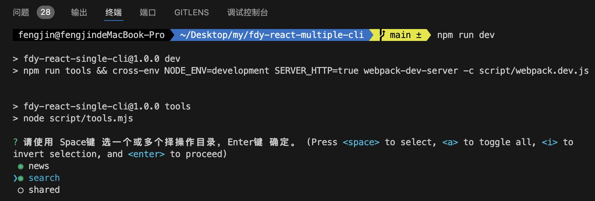
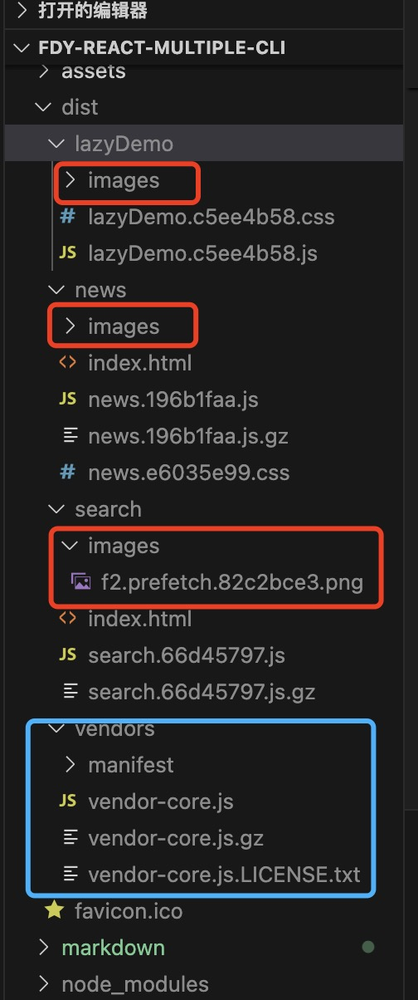
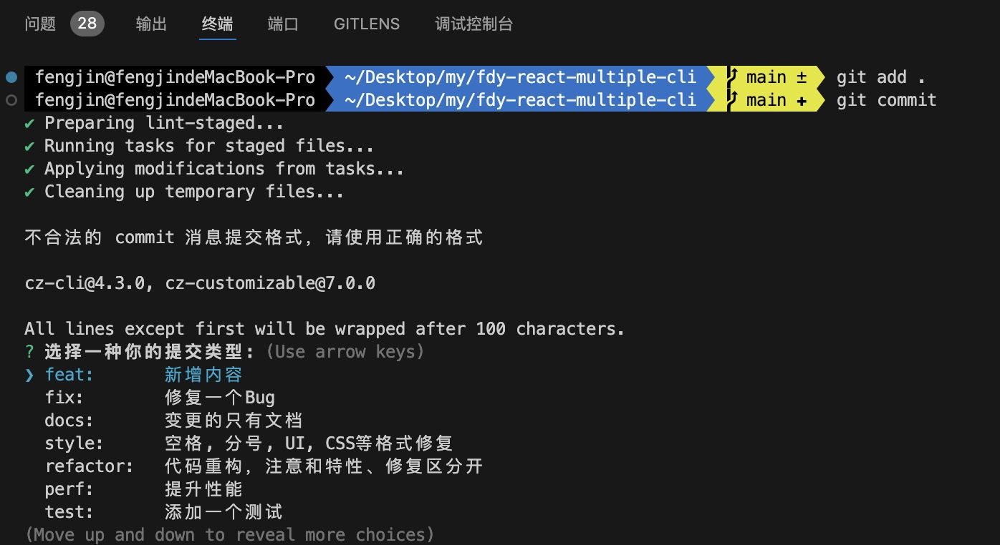

## 1.安装

```bash
#推荐pnpm
pnpm i
```

```bash
yarn
```

```bash
npm i
```

## 2.运行

比如目录有news,search,shared三个页面，现在要使用dev启动news,search，有两种方式

##### 第1种

```bash
npm run dev
```

可以根据操作选择页面



##### 第2种

```bash
# 用英文逗号分隔package
env PACKAGE=news,search npm run dev
```

这个会直接启动dev，不会出现可视化配置窗口。

还有其他命令也是一样

```bash
# 打包命令
npm run build # 可视化
env PACKAGE=news,search npm run build

# 依赖分析，资源消耗分析
npm run build:analy  # 可视化
env PACKAGE=news,search npm run build:analy

# 打完包，然后本地启动服务看看这是打包后的线上效果
npm run build:open  # 可视化
env PACKAGE=news,search npm run build:open
```

```bash
# dll 打包，如果dll中的依赖变更，需要用这个命令重新打包
npm run dll:core
```

## 3.打包产物



注意

1. 红色部分，每一个页面用到的图片会单独打包到这个页面目录
2. 蓝色部分是dll分离出来的包，打包后会自动注入到dist，并且注入到打包页面中。

## 4.提交代码

```bash
# 先执行
git add .
```

然后执行 git commit，这是可视化的提交

```bash
# 先执行
git commit
```



按照提示操作就可以了

但是如果你的commit符合规范，那么就不会出现这个提示，可以直接提交，但是我更推荐是用可视化，因为可以避免输入错误的麻烦。

```bash
# 符合规范的提交将不会出现可视化
git commit -m 'feat: 这是一个新的需求'
```

## 5.问题记录

1. 开发模式时，dll的 mode 也必须是 development ，否则热更新不生效。

2. node --trace-deprecation ./node_modules/.bin/webpack 不性，
   需要 node --trace-deprecation node_modules/webpack/bin/webpack.js --mode production 才能找到报警堆栈信息。

3. npx msw init ./public  
   作用是
   生成 msw需要用到的 mockServiceWorker.js 文件，然后放到公共目录，以便msw在客户端使用。
   （package.json 中也会有对应的字段 "msw": {"workerDirectory": "public"}。）
   ps：安装的2.2.5版本报错 Cannot read properties of undefined (reading 'url')
   解决办法：降级到2.1.4（注意把版本锁死！不能使用^或者~），因为新版本都有问题。然后删除 pnpm-lock.yaml 和 node_modules 重新安装，重新 npx msw init ./public。

4. jest使用msw有各种坑，以下为代表
   https://github.com/mswjs/msw/issues/1810
   https://github.com/mswjs/msw/issues/1796
   https://github.com/mswjs/msw/discussions/1934?sort=old

5. 有入口A-chunck，引入可异步 B-chunk，A和B都引用了 1.png ，打包的时候A的chunk中有
   "1.png(或者id)": () => 绝对路径1 的模块，B中没有这个木块的id，因为B是引用A中的id的

   但如果现在又有一个入口C-chunk，它也引用了异步B-chunk，这时 B-chunk 的模块中就会产生一个
   "1.png(或者id)": () => 绝对路径2 的模块，因为C中没有1.png ，所以B-chunk没法复用，只能创建。

   当C-chunk来捣乱后，那么此时 A-chunck 和 B-chunk又产生了新问题：

   "1.png(或者id)": () => 绝对路径1 的模块，b也有 "1.png(或者id)": () => 绝对路径2 的模块, 由于B是异步的，那么A先执行，把 "1.png(或者id)" 存入到 **webpack_module_cache** 的模块缓存容器中，当B一步执行完，也去设置"1.png(或者id)"这个id时，由于缓存中已经存在，所以直接返回了A的资源，

   所以，
   在A页面访问B，B中的1.png的链接是 绝对路径1，而不是 绝对路径2
   在C页面访问B，B中的1.png的链接是 绝对路径2，而不是 绝对路径1

   正常来说：绝对路径1 和 绝对路径2 总是相等的，引用那个都没有问题，但是，
   split-static-resource-plugin 插件会去修改 绝对路径1 和 绝对路径2，本意是想
   在A引用B的时候，B中的1.png依然能指向B/images中的1.png，但是由于这个机制，导致
   B中的1.png指向了A/images中的1.png

   不过这也不是一个问题了，不会导致结果错误，只是开发中看到不同入口引用同一异步chunk图片路径不一致有点奇怪。

6. 在使用dev模式的时候，css中的图片链接是localhost开头的，不是/\*\*/images这种绝对路径的格式，这是因
   dev环境中没有使用MiniCssExtractPlugin.loader 生成独立的css文件，所以在 files 字段中找不到css件，导致无法使用split-static-resource-plugin 替换路径。

7. 使用异步包存在问题：
   原因：当前项目使用的是可以单独打包的机制，比如说当前有news,search,shared三个页面，我可以三个页面一起打包，也可以
   单独打包某一个页面或两个页面。当三个页面都引入了名字为 lazyDemo 的异步组件时：
   如果只有new打包了，lazyDemo内容为显示订单列表，记作lazyDemo-1，打包部署了；
   过了2天search又改动了 lazyDemo 组件为显示购物车，记作lazyDemo-2，打包部署了，
   那么此时出现的问题是：

   1. 如果 lazyDemo 有hash值的话，new组件就访问不到原来的 lazyDemo-1 了，会报错，因为已经被 lazyDemo-2替换了，hash值变了；
   2. 既是去掉 hash 变量，出现的新问题就是 new 期望显示的是订单列表的内容 和 lazyDemo-1 的 props 参数，但是现在成了
      lazyDemo-2的 props 和 显示购物车，不同的props参数可能造成 lazyDemo-2 组件报错，并且改变了new原有的显示逻辑肯定是不行的。

   解决问题：

   1. 禁止使用异步包。弊端：少了异步加载的特性。
   2. 打包的时候必须所有的页面一起打包。弊端：违背了我们当初设计分页打包的初衷，当页面很多时，打包部署需要的时间会很长！
   3. 使用自定义插件的方式解决上出两个问题的最优解。但是目前我还没研究出来。

   所以，我觉得目前使用方案一更好一点。

8. 使用 npm run open 时要注意清除缓存， http-server -c-1，可以做到。

9. 插件生成新的代码时，sourcemap文件不能生成了，原因在这
   https://stackoverflow.com/questions/65896008/webpack-problem-generating-sourcemaps-only-generated-when-a-particular-plugin

10. script-ext-html-webpack-plugin 已经不维护了，再说也不是费用不可，去掉了。

11. vscode 的 debugger 现在不需要 --inspect-brk

12. msw在初始page页面老是报错，原因尚且不明，所以最好使用无痕模式调试页面。

13. webpack 的 loader 的 option 不能传递函数

14. webpack.DefinePlugin：process.env.NODE_ENV 可以在代码中直接使用，但是其他的环境变量必须手动定义
    并且这个插件，new 多个实例的时候，前面的new定义过的key，后面的new即便定义了相同的key也不会覆盖！
15. window形同上的一些问题：
    15-1. window 需要 在安装完包后 手动执行 pnpm rrepare
    15-2. jest的部分选项在window不支持

```javascript
// window中，testMatch 不支持 <rootDir>/ 这个写法，匹配不出来
// testMatch: [
//   '<rootDir>/src/**/__tests__/**/*.[jt]s?(x)',
//   '<rootDir>/src/**/?(*.)+(spec|test).[tj]s?(x)',
// ],
testMatch: ['**/__tests__/**/*.[jt]s?(x)', '**/?(*.)+(spec|test).[tj]s?(x)'];
```

16. docker 问题
    16-1. dockerfile 中的关键字都必须大写，不然window报错，比如我之前使用as就报错，换成AS就好了。
    16-2. 还有 ENV要用=赋值，不要用空格
    错误写法：ENV TZ Asia/Shanghai
    正确写法：ENV TZ=Asia/Shanghai
    16-3. RUN env PACKAGE=all pnpm build 在window老是报错，有人说重启docker就好了，并没有。
    换成这个就可以了，真是奇怪 RUN /bin/sh -c env PACKAGE=all pnpm build
